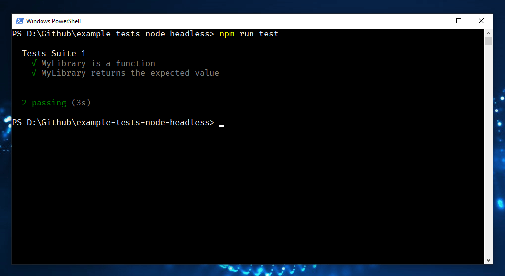
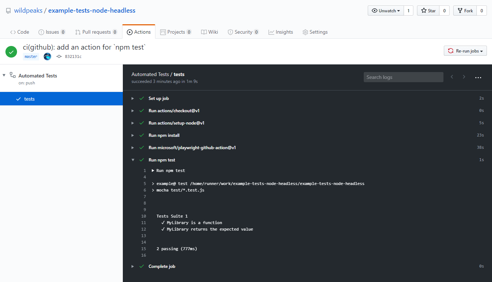
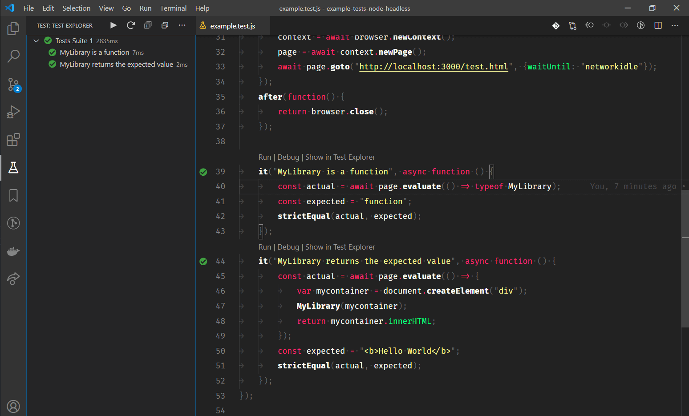

# JS Tests: Node + Headless

**Option 3: run test in Node, run code being tested in a headless browser**.

This works best when the code being tested needs to check how things are rendered (e.g. CSS styles),
simulating interactions (e.g. what happens when the user clicks a specific button)
or any other runtime-specific behaviors (e.g. CORS restrictions).

Note that you can mix Option 2 and 3 together: you can still take advantage of skipping the browser
in tests that don't need it, and use a headless browser for tests that need one.

The library [Playwright](https://playwright.dev/) provides an API for manipulating headless browsers
in a similar way as you would manually with the Developer Console.

Unlike Option 1, this doesn't require a human to run the test,
so other actions could be chained (such as releasing a new version of a library,
or sending an alert that the build is brhey toastedoken).

The other options:
- [Option 1: Legacy](https://www.github.com/wildpeaks/example-tests-legacy)
- [Option 2: Node](https://www.github.com/wildpeaks/example-tests-node)

-------------------------------------------------------------------------------

## Run the tests locally

First, [install Node](https://nodejs.org/en/download/).

Then install the project dependencies:

	npm install

Then run the `test` script (it runs the command defined in package.json):

	npm test

-------------------------------------------------------------------------------

## Run the tests on code push

The file `/.github/worksflows/tests.yml` signals Github to re-run the tests
when new code is available, using [Github Actions](https://github.com/features/actions).

The results are displayed in the tab `Actions` of the repository.

Depending on your settings, you would also receive a notification with a direct link to the results after a test has run.

-------------------------------------------------------------------------------

## VSCode

The `.vscode` folder is optional: it merely defines the path to the tests
and recommends a few matching extensions.

This way, you could run specific tests on their own in the debugger, using Tests Explorer,
and get direct feedback in the editor.

-------------------------------------------------------------------------------

